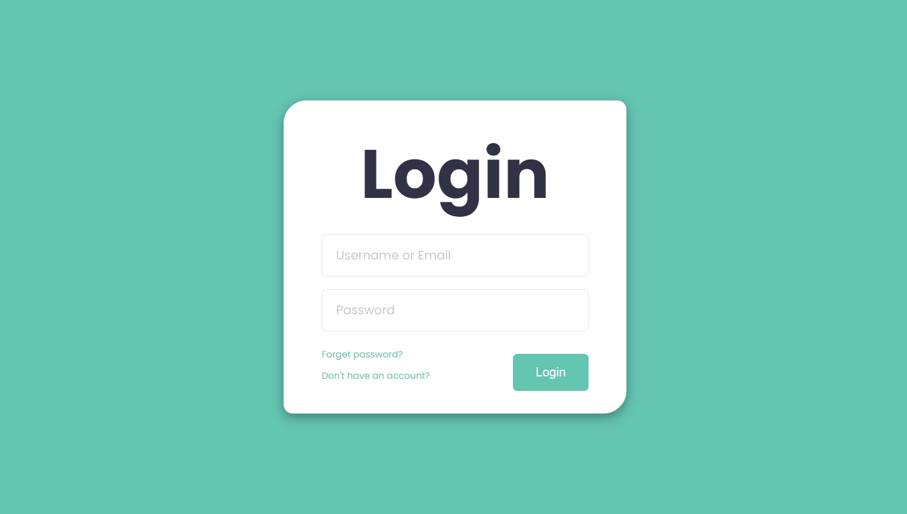
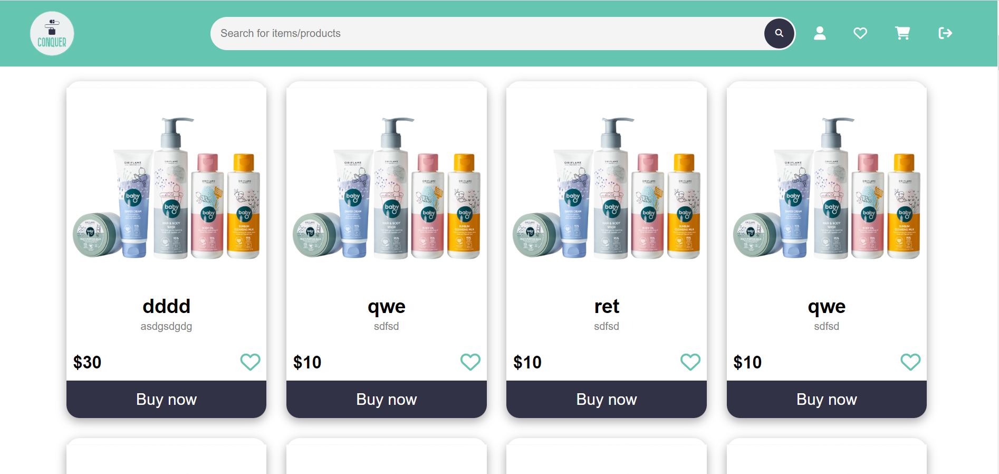
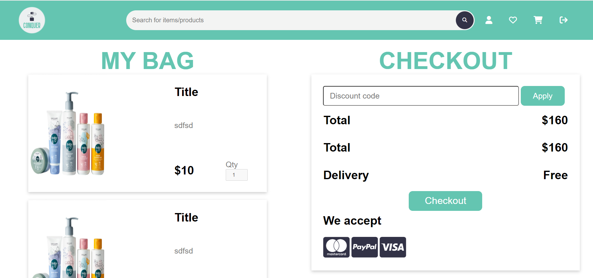
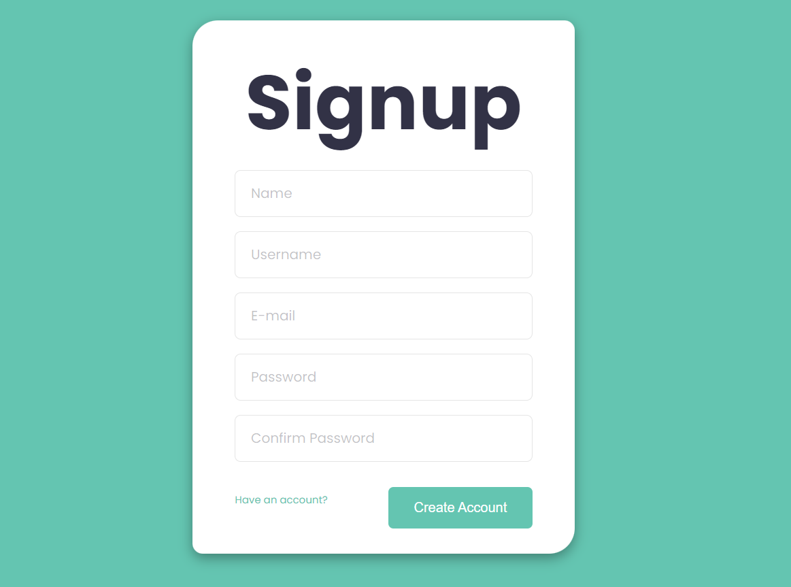
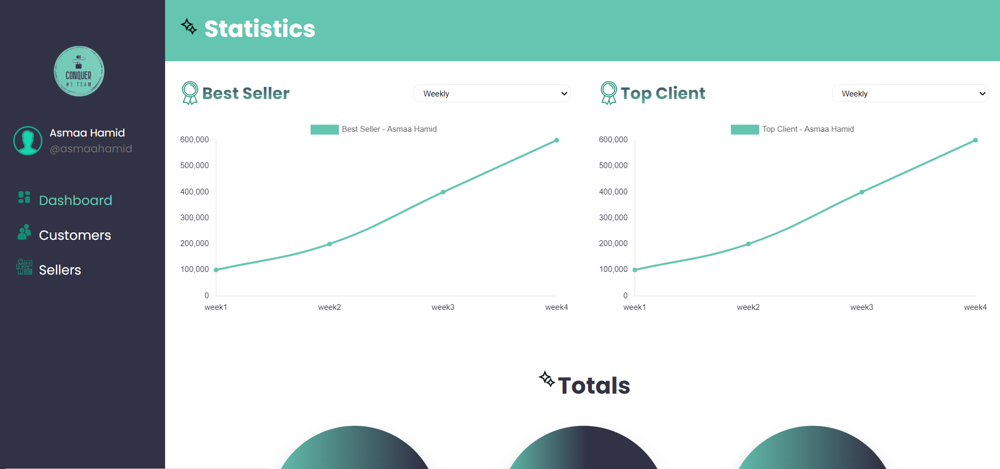
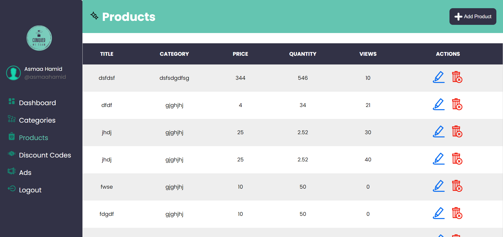
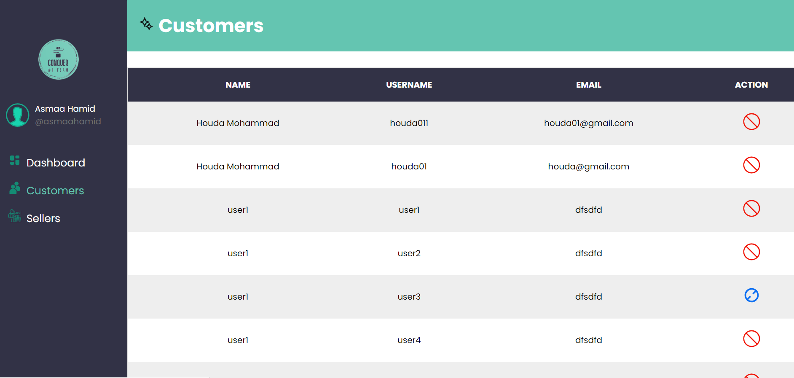
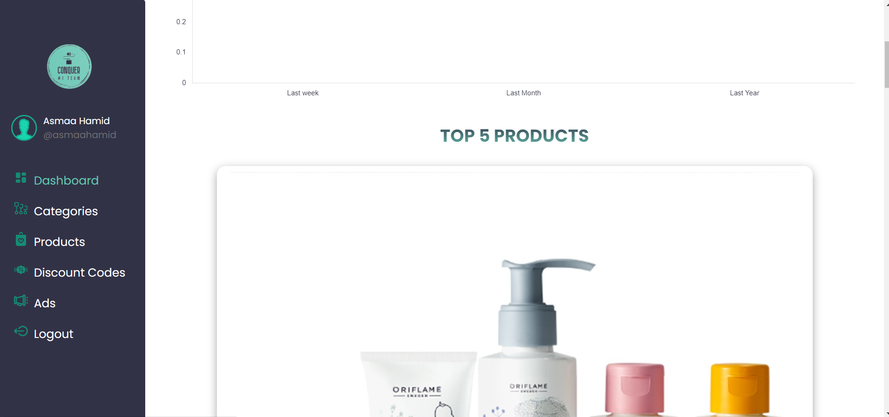

<h1 style="color:#64c5b1">E-Commerce Project</h1>

<h4 style="color:#64c5b1">Team1 - Members: </h4>
<ul>
<li>Asmaa Hamid</li>
<li>Jessy Matta</li>
<li>Peter Saba</li>
</ul>

<h2 style="color:#64c5b1">How To Run</h2>

<ul>
<li>Admin Desktop
<ul>
<li>Navigate to admin-electron/dashboard.html folder</li>
<li>run "npm install" command</li>
<li>run "npm run start" command</li>
</ul>
</li>
<li>Seller Website
<ul>
<li>Navigate to seller-frontend/index.html folder</li>
</ul>
</li>
<li>Client Website
<ul>
<li>Navigate to client-frontend/index.html folder</li>
</ul>
</li>
</ul>

<h3>Preview</h3>
<h4>Client</h4>

<h4>Admin/Seller</h4>

